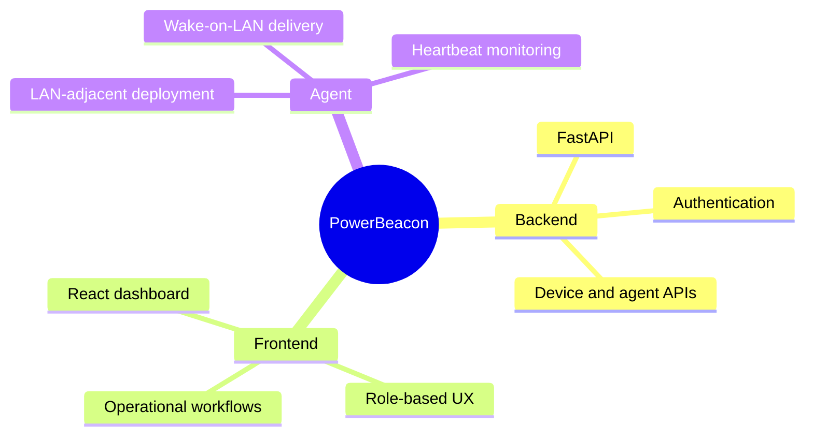

# Development Team

PowerBeacon is developed as a personal project by Konstantinos Andreou, a software engineer with a passion for automation and efficient system management. With a background in software development and a keen interest in network technologies, Konstantinos created PowerBeacon to simplify the process of managing and orchestrating Wake-On-LAN (WOL) devices.

!!! info "Project philosophy"
    Build practical infrastructure software that is straightforward to operate, secure by default, and pleasant to maintain.

## Focus Areas

- Systems automation for everyday operations
- Secure remote device control workflows
- Clear, maintainable architecture boundaries
- Developer-friendly documentation and tooling

## Current Scope

---

## Contact
:lucide-github: [kotsiossp97](https://github.com/kotsiossp97)
:lucide-globe: [kotsiossp97.github.io](https://kotsiossp97.github.io/)

!!! tip "Contributions"
  Bug reports, feedback, and pull requests are welcome.
