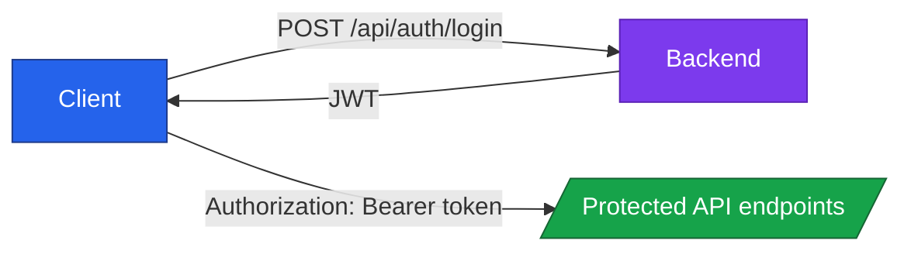

# API Overview

PowerBeacon exposes a REST API under the `/api` prefix. The API is organized by domain and designed for frontend and automation clients.

!!! tip "Interactive API docs"
    - Swagger UI: `http://localhost:8000/api/docs`
    - OpenAPI JSON: `http://localhost:8000/api/openapi.json`

## API Domains

| Domain | Base path | Purpose |
| --- | --- | --- |
| Authentication | `/api/auth` | Local login, current user, OIDC entry/callback |
| Devices | `/api/devices` | CRUD and wake operations |
| Agents | `/api/agents` | Registration, heartbeat, inventory |
| Users | `/api/users` | User and role management |
| Config | `/api/config` | OIDC and runtime configuration |
| Setup | `/api/setup` | First-run platform setup |

## Authentication Model

!!! note "Agent endpoints"
    Agent registration and heartbeat are authenticated with per-agent bearer tokens, not user JWTs.

## Request and Response Conventions

- JSON request/response bodies by default
- UUID identifiers for core entities
- Standard HTTP status codes
- Error payloads include status/message/details where applicable

## Common Workflows

=== "User session"

    1. `POST /api/auth/login`
    2. Store returned `access_token`
    3. Call protected endpoints with `Authorization: Bearer <token>`

=== "Wake a device"

    1. `GET /api/devices/`
    2. Pick device ID
    3. `POST /api/devices/{id}/wake`

=== "Agent lifecycle"

    1. `POST /api/agents/register`
    2. Agent stores token in memory
    3. Agent sends periodic `POST /api/agents/heartbeat`

## Next Steps

- Use Setup pages to get an environment running
- Use Architecture pages to understand internals
- Use Swagger UI for endpoint-level details
