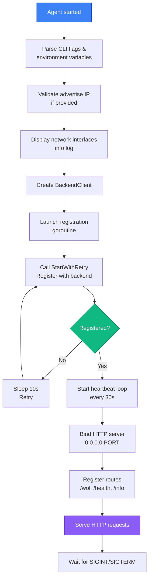

# Agent Architecture

The PowerBeacon Agent is a small, self-contained Go binary. Its purpose is to receive authenticated Wake-on-LAN dispatch commands from the backend and deliver UDP magic packets to devices on the local network.

## Why a Separate Agent?

Containers running on Docker Desktop (Windows/macOS) cannot send UDP broadcast packets that reliably reach sleeping devices on the physical LAN, because Docker Desktop routes traffic through an internal VM with NAT. The agent runs as a native process or container directly on a Linux host (e.g., a Raspberry Pi, NAS, or mini PC) that has a real NIC on the same broadcast domain as the target devices.

## Technology Stack

| Concern | Library |
| --- | --- |
| Language | Go 1.26 |
| HTTP router | gorilla/mux 1.8 |
| WOL packet | stdlib `net` (UDP) |
| Backend registration | stdlib `net/http` |
| OS detection | stdlib `runtime` |

## Directory Structure

```
agent/
├── cmd/agent/
│   └── main.go            # Entry point: flag parsing, registration, HTTP server
├── internal/
│   ├── api/
│   │   └── wol_handler.go # HTTP handlers: POST /wol, GET /health, GET /info
│   ├── client/
│   │   └── backend.go     # BackendClient: register, heartbeat, retry logic
│   ├── network/
│   │   └── broadcast.go   # Local IP and hostname discovery helpers
│   └── wol/
│       └── wol.go         # Magic packet construction and UDP send
├── build/                 # Compiled binaries (darwin-amd64, darwin-arm64, linux-amd64)
└── install/               # install-agent.sh / install-agent.ps1
```

## Startup Sequence



## Configuration

!!! note "How Configuration Works"
    The agent uses a **two-tier configuration system**:
    
    1. **CLI flags** (highest priority) — passed at runtime
    2. **Environment variables** (lower priority) — set on the host or container
    3. **Defaults** (fallback) — if neither flag nor env var is provided

| Flag | Environment Variable | Default | Description |
| --- | --- | --- | --- |
| `--backend` | `BACKEND_URL` | `http://localhost:8000` | Backend base URL |
| `--port` | `AGENT_PORT` | `18080` | Port the agent HTTP API listens on |
| `--bind` | `AGENT_BIND` | `0.0.0.0` | Interface to bind the HTTP server |
| `--advertise-ip` | `AGENT_ADVERTISE_IP` | _(auto-detected)_ | IP the backend should use to reach this agent |

!!! warning "Auto-Detection Gotchas"
    If `--advertise-ip` is not set, the agent auto-detects its local IP. This works fine on single-NIC hosts but can pick the wrong interface on multi-homed servers. **Always explicitly set `--advertise-ip` in production or containerized environments.**

## Registration Protocol

On startup the agent calls `POST /api/agents/register` on the backend with:

```json
{
  "hostname": "my-linux-host",
  "ip": "192.168.1.50",
  "port": 18080,
  "os": "linux",
  "version": "1.0.0"
}
```

If an agent with the same hostname already exists in the backend database, its IP, port, OS, version, and `last_seen` are updated and the existing token is returned. If it is a new agent, a UUID and a new random bearer token are created.

The backend responds with:

```json
{
  "agent_id": "uuid",
  "token": "random-bearer-token"
}
```

The agent stores `agent_id` and `token` in memory. Restarts re-register and receive the same token (idempotent by hostname).

## Heartbeat Protocol

After successful registration, a background goroutine sends a heartbeat every **30 seconds**:

```
POST /api/agents/heartbeat
Authorization: Bearer {token}

{"agent_id": "uuid"}
```

The backend updates `Agent.last_seen` and confirms the agent's status as `online`. If the backend does not receive a heartbeat within a configurable window, the agent is considered `offline` (status tracking is done at the backend level).

## HTTP API

The agent exposes a minimal HTTP API on port 18080 (default):

### `POST /wol`

Dispatches a Wake-on-LAN magic packet. Requires `Authorization: Bearer {token}`.

Request body:

```json
{
  "mac": "AA:BB:CC:DD:EE:FF",
  "broadcast": "192.168.1.255",
  "port": 9
}
```

Validation rules:

- `mac` must be a valid MAC address in colon-separated, dash-separated, or bare hex format.
- `broadcast` must be a valid IP address.
- `port` defaults to 9 if not provided.

Response on success:

```json
{"success": true, "message": "WOL packet sent successfully"}
```

### `GET /health`

Returns HTTP 200 with:

```json
{"status": "healthy", "version": "1.0.0"}
```

No authentication required. Used by the backend `AgentService.check_agent_health()`.

### `GET /info`

Returns agent metadata (hostname, IP, OS, version). No authentication required.

## WOL Packet Implementation

!!! info "Magic Packet Standard"
    The WOL magic packet is defined by the Wake-on-LAN standard as exactly **102 bytes**:
    
    - **Bytes 0–5:** six `0xFF` bytes (synchronization stream).
    - **Bytes 6–101:** the target MAC address repeated 16 times.

The agent's `wol.go` implementation follows these steps:

1. `parseMAC()` — strips `:` and `-` separators, validates that the result is 12 hex characters, and decodes to a 6-byte slice.
2. `buildMagicPacket()` — allocates a 102-byte slice, writes 6 × `0xFF`, then copies the 6-byte MAC 16 times.
3. `sendUDPBroadcast()` — resolves the broadcast address with `net.ResolveUDPAddr`, dials a UDP socket with `net.DialUDP`, and calls `conn.Write(packet)`.

**Supported MAC address formats:**

=== "Colon-separated"
    ```
    AA:BB:CC:DD:EE:FF
    ```

=== "Dash-separated"
    ```
    AA-BB-CC-DD-EE-FF
    ```

=== "Bare hex"
    ```
    AABBCCDDEEFF
    ```

## Token Security

!!! danger "Token Compromise"
    - Each agent receives a **unique bearer token** at registration time.
    - If a token is compromised, **only that agent** is affected; other agents remain secure.
    - Regenerate compromised tokens by re-registering the agent (it will request a new token).
    - The token is stored **in memory only** on the agent process; restarting clears it.

The bearer token used between the backend and agent is:

- Generated randomly by the backend at agent registration.
- Stored in the `agents` table, indexed for fast lookup.
- Sent by the agent in every `POST /api/agents/heartbeat` request.
- Sent by the backend in every `POST http://{agent.ip}:18080/wol` request.
- Validated by the agent's `WOLHandler` before any WOL packet is sent.

If the agent has not yet completed registration (token is empty), the `/wol` endpoint returns `503 Service Unavailable`, preventing unauthenticated WOL execution.

## Installation

!!! tip "Easy Installation"
    Pre-built binaries for common platforms are bundled with the backend and automatically served at standard endpoints.

=== "Linux/macOS One-Liner"

    ```bash
    curl -fsSL http://<backend-host>:8000/install-agent.sh | bash -s -- \
      --backend http://<backend-host>:8000 \
      --advertise-ip 192.168.1.50
    ```

    The install script:
    
    1. Downloads the binary for your OS and architecture
    2. Makes it executable
    3. Optionally installs as a system service

=== "Manual (Any OS)"

    ```bash
    # Download binary
    curl -O http://<backend-host>:8000/agents/linux-amd64
    chmod +x powerbeacon-agent
    
    # Run directly
    ./powerbeacon-agent \
      --backend http://<backend-host>:8000 \
      --port 18080 \
      --advertise-ip 192.168.1.50
    ```

=== "Docker"

    ```bash
    docker run -d \
      --name powerbeacon-agent \
      --network host \
      -e BACKEND_URL=http://<backend-host>:8000 \
      -e AGENT_PORT=18080 \
      -e AGENT_ADVERTISE_IP=192.168.1.50 \
      powerbeacon/agent:latest
    ```

    !!! warning "Docker Networking"
        Use `--network host` so the agent can send UDP broadcasts to the LAN. Without it, Docker's default bridge network isolates the agent from the physical network.

## Supported Platforms

| Platform | Architecture | Notes |
| --- | --- | --- |
| Linux | amd64 | Primary deployment target |
| macOS | amd64, arm64 | Development and testing; LAN broadcast works natively |
| Windows | — | Binary not currently shipped; build from source if needed |

## Relationship to Backend

The agent is intentionally stateless. It does not persist any data locally. All state (agent ID, token, status) lives in the backend database. This means:

- Reinstalling or replacing an agent binary on the same host re-registers by hostname and resumes normal operation.
- Multiple agents can be registered and each device is assigned to exactly one agent via `Device.agent_id`.
- The backend can reach out to any registered agent using the `ip:port` stored at registration time.
