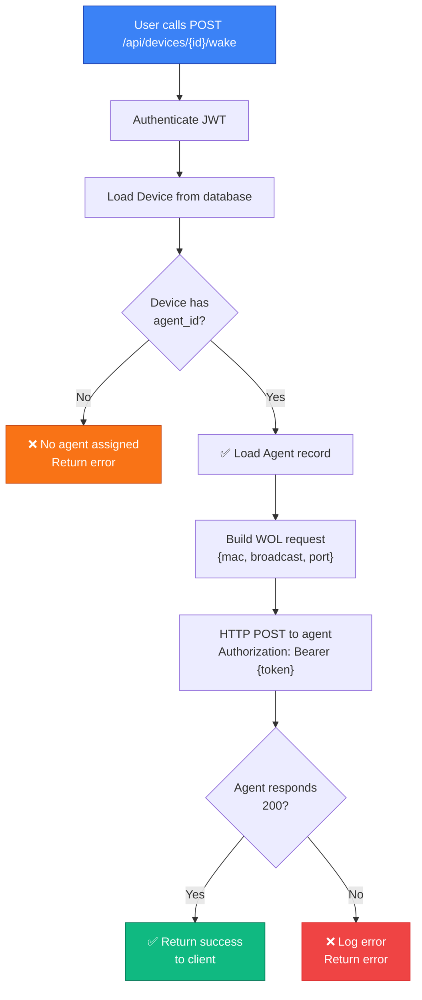

# Backend Architecture

The backend is a Python 3.13 API service built with FastAPI. It handles authentication, user and device management, agent lifecycle, and Wake-on-LAN dispatch coordination.

## Technology Stack

| Concern | Library | Version |
| --- | --- | --- |
| Web framework | FastAPI | 0.135 |
| ASGI server | Uvicorn | 0.41 |
| ORM | SQLModel + SQLAlchemy | 0.0.37 / 2.0 |
| Database driver | psycopg2-binary | 2.9 |
| Password hashing | pwdlib (Argon2 + bcrypt) | 0.3 |
| JWT | PyJWT | 2.11 |
| OIDC client | Authlib | 1.6 |
| Settings management | pydantic-settings | 2.13 |
| HTTP client (agent dispatch) | httpx | 0.28 |

## Directory Structure

```
backend/
├── main.py                   # FastAPI app entry, lifespan, middleware registration
├── requirements.txt           # Pinned dependencies
├── pyproject.toml             # Project metadata and dev dependencies (uv)
└── powerbeacon/
    ├── core/
    │   ├── config.py          # Settings class (pydantic-settings, reads .env)
    │   ├── db.py              # SQLAlchemy engine, init_db()
    │   ├── deps.py            # FastAPI Depends: SessionDep, CurrentUser, etc.
    │   └── security.py        # JWT creation, password hash/verify
    ├── models/
    │   ├── users.py           # User, UserPublic, UserCreate, UserRole enum
    │   ├── devices.py         # Device, DevicePublic, DeviceCreate, OSType enum
    │   ├── agents.py          # Agent, AgentRegistration, AgentHeartbeat, AgentStatus
    │   ├── config.py          # Config DB models (OIDC settings)
    │   └── generic.py         # Token, TokenPayload, Message, ErrorResponse
    ├── routes/
    │   ├── login.py           # POST /api/auth/login, GET /api/auth/me, OIDC callbacks
    │   ├── users.py           # CRUD /api/users
    │   ├── devices.py         # CRUD /api/devices, POST /api/devices/{id}/wake
    │   ├── agents.py          # Register, heartbeat, list, delete /api/agents
    │   ├── config.py          # OIDC configuration /api/config
    │   └── setup.py           # First-run setup /api/setup
    ├── crud/
    │   ├── user_crud.py       # User DB operations
    │   ├── agent_crud.py      # Agent DB operations
    │   └── config_crud.py     # Config DB operations
    └── services/
        ├── agent_service.py   # AgentService: WOL dispatch and health checks
        └── oidc.py            # Authlib OAuth client factory
```

## Application Lifecycle

`main.py` defines a `lifespan` context manager that runs `init_db()` on startup. `init_db()` imports all SQLModel table classes and calls `SQLModel.metadata.create_all(engine)` to create tables if they are missing. This covers fresh environments without requiring a separate migration step.

Middleware registration order in `main.py`:

1. `SessionMiddleware` — required for Authlib/OIDC OAuth flows.
2. `CORSMiddleware` — configured from `settings.cors_origins`.

All route modules are attached under a single `/api` prefix via `APIRouter`.

## Configuration

!!! warning "Production Secrets"
    - `JWT_SECRET` must be a strong, random value (minimum 32 characters).
    - Never commit secrets to version control.
    - Rotate `JWT_SECRET` periodically; existing tokens will become invalid.
    - Use a secrets manager (Vault, AWS Secrets Manager, etc.) in production.

Configuration is handled by a `Settings` class (`powerbeacon/core/config.py`) using pydantic-settings. Values are read from the environment or a `.env` file at the root of the backend directory.

| Variable | Default | Description |
| --- | --- | --- |
| `DB_URL` | `postgresql+psycopg2://powerbeacon:changeMe@db:5432/powerbeacon` | Database connection string |
| `JWT_SECRET` | _(insecure default)_ | HMAC secret for JWT signing — **must be changed in production** |
| `JWT_EXPIRATION_HOURS` | `24` | JWT lifetime in hours |
| `FRONTEND_URL` | `http://localhost:5173` | Used for OIDC callback redirect |
| `CORS_ORIGINS` | `["http://localhost:3000","http://localhost:5173"]` | Allowed CORS origins |
| `PASSWORD_MIN_LENGTH` | `8` | Minimum password length enforced at creation |

## Data Models

### User

```
users table
├── id             UUID PK
├── username       str  unique, indexed
├── email          str  unique, nullable
├── full_name      str  nullable
├── hashed_password str
├── role           enum: superuser | admin | user | viewer
├── is_active      bool
└── created_at     timestamptz
```

Role hierarchy governs all authorization checks in route handlers:

| Role | Capabilities |
| --- | --- |
| `superuser` | Full access including user management, settings |
| `admin` | Manage users, devices, agents; wake devices |
| `user` | Manage and wake own devices; view agents |
| `viewer` | Read-only: view devices |

### Device

```
devices table
├── id             UUID PK
├── name           str
├── mac_address    str  unique, indexed
├── ip_address     str  optional, indexed
├── os_type        enum: linux | windows | macos
├── is_active      bool
├── description    str  optional
├── tags           JSON  (list of strings)
├── agent_id       UUID FK → agents.id (optional)
├── owner_id       UUID (user ID, not FK — loose coupling)
├── created_at     timestamptz
└── updated_at     timestamptz
```

`agent_id` links a device to the agent responsible for sending its WOL packet. If `agent_id` is null, the device cannot be woken via relay mode.

### Agent

```
agents table
├── id         UUID PK
├── hostname   str
├── ip         str  indexed (IPv4/IPv6)
├── port       int  default 18080
├── os         enum: linux | windows | darwin
├── version    str
├── token      str  indexed (bearer token)
├── status     enum: online | offline
├── last_seen  timestamptz
└── created_at timestamptz
```

The `token` field is a randomly generated secret issued at agent registration. The backend uses it to authenticate outbound WOL dispatch requests to the agent. Agents use the same token in the `Authorization: Bearer` header when sending heartbeats.

## Authentication

!!! success "Authentication Methods"
    PowerBeacon supports two authentication modes. Choose one based on your deployment environment.

=== "Local Auth"

    **Use case:** Small teams, development, environments without SSO infrastructure.

    ```mermaid
    sequenceDiagram
        participant Client
        participant API as /api/auth/login
        participant Database
        
        Client->>API: POST with username & password
        API->>Database: Fetch user by username
        Database-->>API: User record
        API->>API: Verify password (Argon2)
        alt Success
            API->>API: Sign HS256 JWT<br/>(sub: user_id, exp: now+24h)
            API-->>Client: {access_token}
        else Failure
            API-->>Client: 401 Unauthorized
        end
    ```

    **Configuration:**

    ```env
    AUTH_MODE=local
    JWT_SECRET=your-super-secret-key-change-this
    JWT_EXPIRATION_HOURS=24
    ```

    **Password Hashing:**
    
    - Primary: **Argon2** (modern, resistant to GPU attacks)
    - Legacy fallback: **bcrypt** (for imported users)
    - Minimum length: 8 characters (configurable)

=== "OIDC (SSO)"

    **Use case:** Enterprise deployments with single sign-on (Keycloak, Auth0, Okta, etc.).

    ```mermaid
    sequenceDiagram
        participant Client
        participant Backend
        participant Provider as OIDC Provider
        
        Client->>Backend: GET /api/auth/login/oauth
        Backend->>Provider: Redirect to authorization endpoint
        Provider-->>Client: Login form
        Client->>Provider: Authenticate
        Provider-->>Backend: Callback with auth code
        Backend->>Provider: Exchange code for tokens
        Provider-->>Backend: access_token + userinfo
        Backend->>Backend: Create/update local user
        Backend->>Backend: Sign local JWT
        Backend-->>Client: Redirect with JWT in query
    ```

    **Configuration:**

    ```env
    OIDC_ISSUER_URL=https://keycloak.example.com/realms/master
    OIDC_CLIENT_ID=powerbeacon
    OIDC_CLIENT_SECRET=your-client-secret
    ```

    **Features:**
    
    - Automatic user provisioning on first login
    - User attributes synced from provider (email, full name)
    - Works with any OpenID Connect-compliant provider

### JWT Validation (FastAPI Dependency)

`deps.py` defines `get_current_user()` as a FastAPI dependency. It:

1. Extracts the bearer token via `OAuth2PasswordBearer`.
2. Decodes and validates the JWT using `PyJWT` with the configured secret and `HS256` algorithm.
3. Reads the `sub` claim, fetches the `User` from the database, and confirms the user is active.
4. Returns the `User` object; any route that declares `CurrentUser` as a parameter receives it automatically.

## Route Map

| Method | Path | Auth required | Description |
| --- | --- | --- | --- |
| `POST` | `/api/auth/login` | No | Local token login |
| `GET` | `/api/auth/me` | User | Current user info |
| `GET` | `/api/auth/login/oauth` | No | OIDC redirect |
| `GET` | `/api/auth/callback` | No | OIDC callback |
| `GET` | `/api/devices/` | User | List all devices |
| `GET` | `/api/devices/{id}` | User | Get device |
| `POST` | `/api/devices/` | User (non-viewer) | Create device |
| `PUT` | `/api/devices/{id}` | Owner or superuser | Update device |
| `DELETE` | `/api/devices/{id}` | Owner or superuser | Delete device |
| `POST` | `/api/devices/{id}/wake` | User | Dispatch WOL |
| `POST` | `/api/agents/register` | No (agent call) | Register agent |
| `POST` | `/api/agents/heartbeat` | Agent token | Agent heartbeat |
| `GET` | `/api/agents/` | User | List agents |
| `DELETE` | `/api/agents/{id}` | Admin+ | Remove agent |
| `GET` | `/api/users/` | Admin+ | List users |
| `POST` | `/api/users/` | Superuser | Create user |
| `PUT` | `/api/users/{id}` | Superuser or self | Update user |
| `DELETE` | `/api/users/{id}` | Superuser | Delete user |
| `GET` | `/api/config/oidc` | Admin+ | Get OIDC config |
| `PUT` | `/api/config/oidc` | Superuser | Update OIDC config |
| `GET` | `/api/setup/status` | No | Setup completion status |
| `POST` | `/api/setup/` | No | Initial admin setup |
| `GET` | `/health` | No | Health probe |

## WOL Dispatch Flow (Backend Side)



When a client calls `POST /api/devices/{id}/wake`:

1. Route handler loads the `Device` from the database.
2. If `device.agent_id` is set, it loads the corresponding `Agent`.
3. Calls `agent_service.dispatch_wol(agent, mac_address, broadcast_address, port)`.
4. `AgentService.dispatch_wol()` builds the JSON payload and calls `POST http://{agent.ip}:{agent.port}/wol` using `httpx`, including `Authorization: Bearer {agent.token}`.
5. If the HTTP call succeeds (2xx), returns success to the caller.
6. On network error or non-2xx response, logs the failure and returns an error to the caller.

## Database Initialization

`init_db()` uses `SQLModel.metadata.create_all(engine)` with `pool_pre_ping=True` on the engine so stale connections are detected and replaced automatically. In production, consider replacing `create_all` with Alembic migrations for controlled schema evolution.

## Built-in API Documentation

When the backend is running, interactive API documentation is available at:

- Swagger UI: `http://localhost:8000/api/docs`
- OpenAPI spec: `http://localhost:8000/api/openapi.json`
