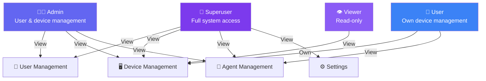
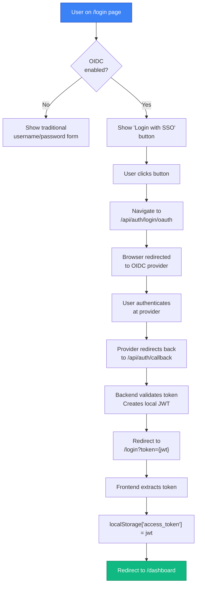

# Frontend Architecture

The frontend is a single-page application built with React 19, TypeScript, and Vite 7. It communicates exclusively with the backend REST API and supports both local JWT authentication and OIDC-based SSO.

## Technology Stack

| Concern | Library | Version |
| --- | --- | --- |
| UI framework | React | 19 |
| Build tool | Vite | 7 |
| Language | TypeScript | ~5.9 |
| Styling | Tailwind CSS | 4 |
| Component primitives | Radix UI, shadcn/ui | — |
| State management | Zustand | 5 |
| Routing | React Router | 7 |
| HTTP client | Axios | 1.x |
| Forms | React Hook Form + Zod | — |
| OIDC client | oidc-client-ts | 3 |
| Animations | Motion | 12 |
| Icons | Lucide React | 0.577 |
| Notifications | Sonner | 2 |

## Directory Structure

```
frontend/src/
├── main.tsx            # React DOM entry, theme provider bootstrap
├── App.tsx             # Root routing and auth initialization logic
├── index.css           # Global styles, Tailwind directives
├── types.ts            # Shared TypeScript types (User, Device, Agent, Permission, …)
├── api/
│   ├── client.ts       # Axios instance: base URL, JWT interceptor, 401 handler
│   ├── auth.ts         # authApi: login, getCurrentUser
│   ├── devices.ts      # devicesApi: CRUD + wake action
│   ├── clusters.ts     # clustersApi: CRUD, detail, wake action
│   ├── agents.ts       # agentsApi: list, delete
│   ├── users.ts        # usersApi: CRUD
│   ├── config.ts       # configApi: OIDC config read/write
│   └── setup.ts        # setupApi: setup status, initial admin creation
├── auth/
│   ├── useAuth.ts      # Zustand auth store (global state: user, token, permissions)
│   ├── localAuth.ts    # Local JWT login/logout helpers
│   ├── permissions.ts  # Role → Permission mapping table
│   └── ProtectedRoute.tsx  # Route guard: redirects unauthenticated users to /login
├── components/
│   ├── layout/         # Layout shell, navigation sidebar, header
│   ├── devices/        # DeviceCard, device form, wake button, device summaries
│   ├── clusters/       # Cluster cards, forms, delete dialog, detail helpers
│   ├── agents/         # AgentCard, AgentList
│   ├── users/          # UserTable, UserForm
│   └── ui/             # Base UI primitives (shadcn/ui wrappers)
├── routes/
│   ├── LoginPage.tsx
│   ├── OnboardingPage.tsx
│   ├── DashboardPage.tsx
│   ├── ClustersPage.tsx
│   ├── ClusterDetailPage.tsx
│   ├── UsersPage.tsx
│   ├── AgentsPage.tsx
│   └── SettingsPage.tsx
├── lib/
│   └── utils.ts        # Tailwind class merging (clsx + tailwind-merge)
└── assets/             # Static images and icons
```

## Application Bootstrap

`App.tsx` orchestrates initialization before rendering any page:

1. `checkSetup()` — calls `GET /api/setup/status`. If setup is incomplete, the app routes all traffic to `OnboardingPage`.
2. `loadAuthConfig()` — calls `GET /api/config/oidc` to determine whether the OIDC login button is shown.
3. `loadCurrentUser()` — reads `localStorage["access_token"]` and, if present, calls `GET /api/auth/me` to restore authenticated state. On 401, the token is discarded.

A loading spinner is shown until all three checks complete.

## Routing

React Router 7 with `BrowserRouter`. Routes are declared in `App.tsx`:

| Path | Component | Guard |
| --- | --- | --- |
| `/login` | `LoginPage` | Redirects to `/` when already authenticated |
| `/onboarding` | `OnboardingPage` | Redirects to `/` when setup is complete |
| `/` | `Layout` | `ProtectedRoute` — redirects to `/login` if unauthenticated |
| `/dashboard` | `DashboardPage` | Inside protected layout |
| `/clusters` | `ClustersPage` | Inside protected layout |
| `/clusters/:clusterId` | `ClusterDetailPage` | Inside protected layout |
| `/users` | `UsersPage` | Inside protected layout |
| `/agents` | `AgentsPage` | Inside protected layout |
| `/settings` | `SettingsPage` | Inside protected layout |

`ProtectedRoute` checks `useAuthStore().isAuthenticated`. Unauthenticated visits are immediately redirected to `/login`.

## API Client

`api/client.ts` creates a single Axios instance shared by all API modules:

- **Base URL**: reads from `import.meta.env.VITE_API_BASE_URL` at build time, falling back to `window.location.origin` so the frontend can be served behind a reverse proxy without hardcoded URLs.
- **Request interceptor**: appends `Authorization: Bearer {token}` from `localStorage["access_token"]` to every outgoing request.
- **Response interceptor**: on a `401` response, clears the stored token and redirects to `/login`. Login requests (`/auth/login`) are excluded from the redirect to allow the login form to display error messages.

Each API module (`devices.ts`, `agents.ts`, etc.) imports and wraps this client, keeping route logic close to its domain.

## Authentication State (Zustand)

A single Zustand store in `auth/useAuth.ts` (`useAuthStore`) holds the global auth state:

```typescript
{
  isSetupComplete: boolean | null,
  oidcEnabled: boolean,
  isAuthenticated: boolean,
  user: User | null,
  loading: boolean,
  error: string | null,
}
```

Key actions:

| Action | Effect |
| --- | --- |
| `checkSetup()` | Sets `isSetupComplete` from `/api/setup/status` |
| `loadAuthConfig()` | Sets `oidcEnabled` from `/api/config/oidc` |
| `loadCurrentUser()` | Restores session from stored token via `/api/auth/me` |
| `setAuthenticated(true, user)` | Sets user after successful login |
| `logout()` | Removes `localStorage` token, resets state |
| `hasPermission(permission)` | Checks current user role against `permissions.ts` matrix |

JWT tokens are stored in `localStorage["access_token"]`. On 401 from any protected endpoint, the Axios interceptor clears the token, and the Zustand store is reset on the next page load.

## Role-Based UI

!!! info "Permission System"
    PowerBeacon implements role-based access control (RBAC) with four roles. UI controls are conditionally rendered based on the current user's permissions.



`auth/permissions.ts` defines a static role-to-permission mapping:

| Role | Permissions |
| --- | --- |
| `superuser` | All: manage and view users, devices, agents, settings; wake devices |
| `admin` | Manage and view users, devices, agents; wake devices |
| `user` | Manage and wake own devices; view agents |
| `viewer` | View devices only |

Components and pages call `useAuthStore().hasPermission("manage_devices")` (or similar) to conditionally render actions such as create/edit/delete buttons and wake controls.

The cluster pages reuse the same permission model: device-management permissions unlock cluster create and edit actions, while wake permissions unlock cluster-wide wake actions.

## OIDC Login Flow (Frontend side)

!!! tip "OIDC Support"
    When `oidcEnabled` is true (fetched from `/api/config/oidc`), the login page automatically renders an "Login with SSO" button.



## Component Organization

Components are organized by domain under `components/`:

- `layout/` — Persistent shell rendered by the protected `Layout` route. Contains the sidebar navigation and top header.
- `devices/` — All device-related views including card display, list view, multi-agent create/edit form, and wake action button.
- `clusters/` — Cluster cards, create/edit dialogs, delete confirmation, and cluster-specific management UI.
- `agents/` — Agent status cards and list view.
- `users/` — User management table and forms (admin only).
- `ui/` — Low-level primitives generated or adapted from shadcn/ui: `Button`, `Input`, `Dialog`, `Table`, `Badge`, etc.

## Build and Output

```bash
npm run build          # tsc + vite build → dist/
npm run dev            # vite dev server on :5173 with HMR
npm run lint           # eslint with TypeScript rules
npm run preview        # serve the dist/ build locally
```

In production, the `dist/` output is served by Nginx inside the `frontend` container. The Nginx config serves `index.html` for all paths, enabling client-side routing.
