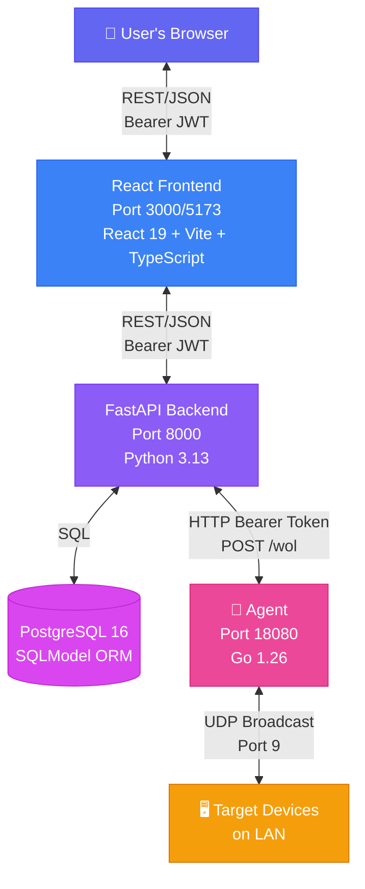
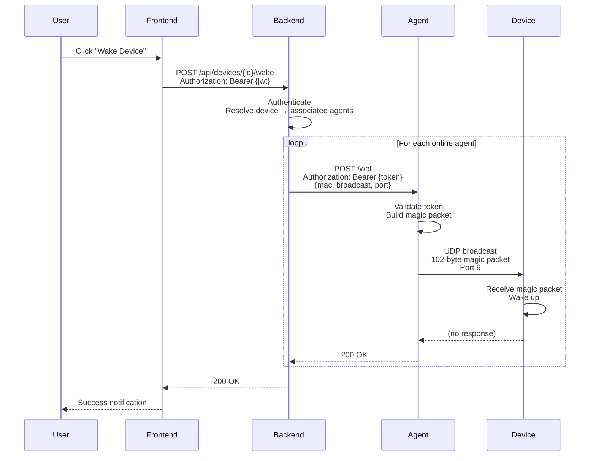
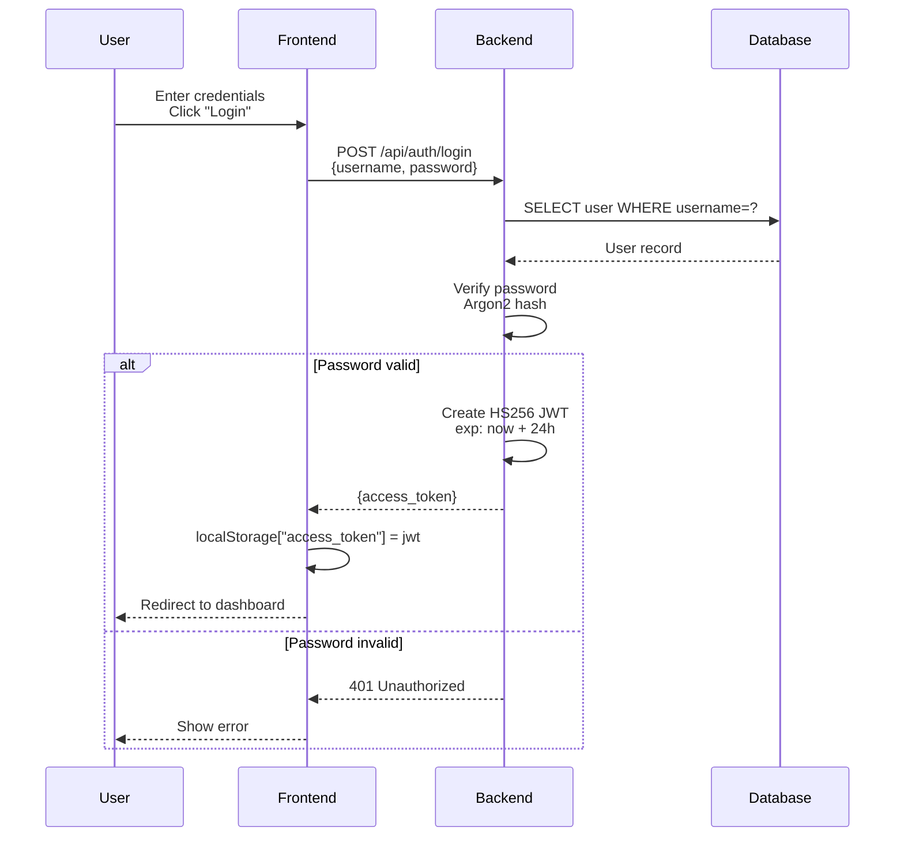
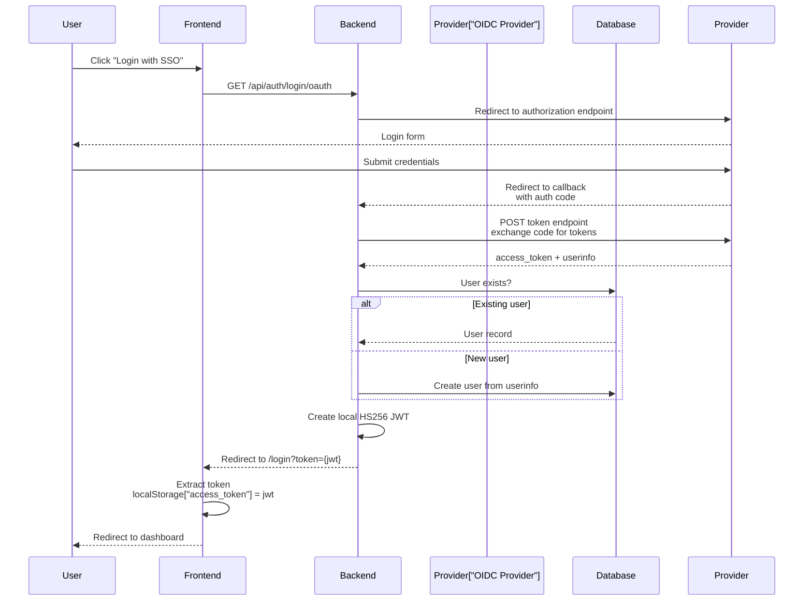

# Architecture Overview

PowerBeacon is a three-tier application: a Python backend API, a React frontend, and one or more lightweight Go agents deployed on LAN-adjacent hosts. All three components communicate over HTTP.

At the domain level, the application is cluster-aware:

- A cluster groups related devices and agents.
- A device belongs to zero or one cluster.
- A device can have multiple associated agents.
- A wake request is dispatched through every associated online agent.

## System Diagram



## Components

| Component | Language / Runtime | Responsibility |
| --- | --- | --- |
| Backend | Python 3.13, FastAPI | API, auth, device/agent lifecycle, WOL dispatch coordination |
| Frontend | TypeScript, React 19, Vite 7 | Dashboard, device/agent management, wake actions |
| Agent | Go 1.26 | LAN-side WOL packet sender; registers and heartbeats with backend |
| Database | PostgreSQL 16 | Persistent state: users, devices, agents, config |

## Request Flow: Wake a Device



## Request Flow: User Login (Local Auth)



## Request Flow: User Login (OIDC)



## Deployment Topologies

### Docker Compose (Recommended)

All services run as containers on the same Docker network. The agent is separate and must run on a Linux host with native LAN access to reach sleeping devices via UDP broadcast (Docker Desktop on Windows/macOS cannot reliably deliver LAN broadcast packets from containers).

```
docker compose up --build        # production compose
docker compose -f docker-compose.dev.yml up --build  # dev compose with hot-reload
```

### Local Development

Each service runs as a native process. PostgreSQL is run locally or in a single container. See [Local Development](../setup/development.md).

## Technology Stack Summary

| Layer | Key Libraries |
| --- | --- |
| Backend framework | FastAPI 0.135, Starlette, Uvicorn |
| ORM / DB | SQLModel 0.0.37, SQLAlchemy 2.0, psycopg2-binary |
| Auth | PyJWT, pwdlib (Argon2 + bcrypt), Authlib (OIDC) |
| Frontend framework | React 19, React Router 7, Vite 7 |
| UI | Tailwind CSS 4, Radix UI, shadcn/ui |
| Frontend state | Zustand 5 |
| HTTP client | Axios 1.x |
| Agent HTTP router | gorilla/mux 1.8 |
| Agent WOL | stdlib `net` package (UDP) |

## Security Model

!!! note "Authentication & Authorization"
    - All `/api/*` endpoints require a valid JWT except `/api/auth/login`, `/api/setup/*`, and `/api/agents/register`.
    - JWT tokens are signed with HS256 using `JWT_SECRET` (must be changed in production).
    - Tokens include `sub` (user ID) and `exp` (expiration timestamp).
    - Token lifetime: 24 hours (configurable via `JWT_EXPIRATION_HOURS`).

!!! warning "Agent Authorization"
    - Each agent receives a **unique bearer token** at registration time.
    - Agents authenticate heartbeats: `POST /api/agents/heartbeat` with `Authorization: Bearer {token}`.
    - Backend authenticates WOL dispatch to agents using the same token.
    - Token compromise on one agent does **not** affect other agents.

!!! info "Additional Security"
    - CORS is restricted to configured origins (default: `localhost:3000`, `localhost:5173`).
    - Passwords are hashed with **Argon2** (primary) with **bcrypt** as a legacy fallback.
    - Rate limiting available on sensitive endpoints (recommended for production).

## Further Reading

- [Backend Architecture](backend.md)
- [Frontend Architecture](frontend.md)
- [Agent Architecture](agent.md)
