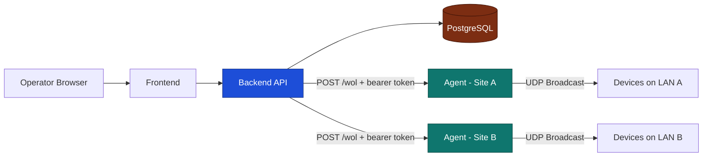

# Production Deployment Overview

This page gives you the high-level production deployment model for PowerBeacon before you choose a specific installation method.

PowerBeacon is designed as a control plane plus execution plane:

- Control plane: frontend + backend + database
- Execution plane: one or more LAN-adjacent agents that send Wake-on-LAN packets

## Recommended Production Pattern

For most teams, the most reliable pattern is:

1. Run frontend, backend, and PostgreSQL on your server infrastructure.
2. Deploy at least one agent per target LAN/subnet.
3. Associate devices with one or more agents for redundancy.

!!! warning "Do not bypass the agent"
    Keep Wake-on-LAN dispatch in the agent layer. The backend should orchestrate wake actions, not emit LAN magic packets directly.

## Topology At A Glance

## Environment And Network Requirements

- HTTPS termination in front of frontend and backend
- Strong, unique values for secrets (especially `JWT_SECRET` and database credentials)
- Reachable backend API from all deployed agents
- Outbound internet access for image/package retrieval during installation
- Inbound connectivity for user access to frontend/backend entrypoints

For Wake-on-LAN reliability:

- Place agents on hosts with direct LAN access to sleeping devices
- Prefer host-installed agents on Windows/macOS environments using Docker Desktop
- Run multiple agents for high-value devices across critical subnets

!!! note "Docker Desktop reminder"
    On Windows and macOS, container-originated LAN broadcasts are often unreliable. Keep agents on LAN hosts and let the backend dispatch through them.

## Security Baseline

Minimum production security posture:

1. Use non-default secrets and rotate them regularly.
2. Restrict CORS origins to known frontend URLs.
3. Use HTTPS for user-facing routes and any remote agent-to-backend traffic.
4. Protect PostgreSQL network exposure (private network, firewall rules).
5. Monitor agent registration and heartbeat status for unexpected changes.

## Rollout Checklist

1. Prepare `.env` with production values.
2. Deploy control-plane services (frontend, backend, database).
3. Complete initial setup and admin bootstrap.
4. Install and register agents on target LANs.
5. Associate agents with devices/clusters.
6. Validate wake flow with a test device per subnet.
7. Add backups, logging, and alerting.

## Scaling Guidance

- Scale horizontally by adding agents close to each subnet.
- Associate important devices with multiple agents for better wake success.
- Keep backend and database resources sized for expected API and heartbeat load.
- Segment by clusters to keep operational boundaries clear.

## Next Steps

- For containerized deployment instructions, continue with [Docker Deployment](docker.md).
- For architecture deep dive, see [Architecture Overview](../architecture/overview.md).
- For day-2 practices, continue to [Operations](../operations/index.md).

