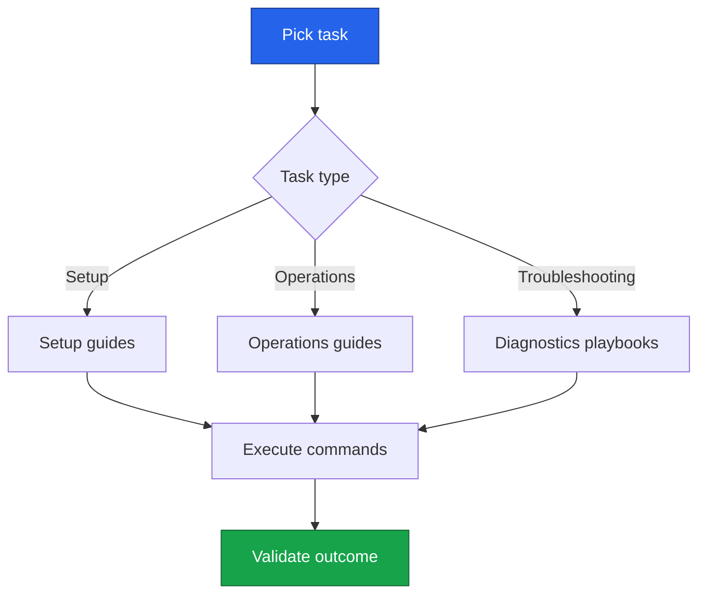

# Guides

This section provides task-driven walkthroughs for common PowerBeacon operations.

## Guide Path

## Recommended Guide Topics

- First successful wake from the dashboard
- Registering and validating a new agent
- Assigning devices to the correct agent
- Role and permission setup for teams
- Diagnosing failed wake attempts

!!! info "Authoring style"
    Prefer guide pages with: Objective, Prerequisites, Steps, Verification, and Troubleshooting.

## Guide Template

=== "Structure"

    1. Objective
    2. Prerequisites
    3. Steps
    4. Verification
    5. Recovery and rollback

=== "Quality checklist"

    - Commands are copy/paste-safe
    - Every major step has a verification check
    - Common failure paths are documented
    - Links to related sections are included
