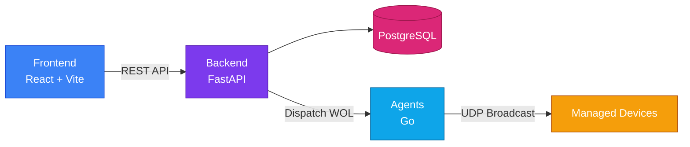

# Home

<p align="center">
	
</p>

<p align="center"><strong>Wake-on-LAN orchestration for modern fleets</strong></p>

<p align="center">
PowerBeacon helps you wake, manage, and monitor machines across distributed networks with a secure backend, a responsive frontend, and a lightweight cross-platform agent.
</p>

<p align="center">
Clusters group devices and agents, devices can use multiple agents, and wake operations fan out through all associated online relays.
</p>

!!! tip "New to PowerBeacon?"
      Start with [Setup Overview](setup/initial.md), then continue with [Architecture Overview](architecture/overview.md).

## Product Snapshot



## Start Here

| Area                      | What you will find                                                |
| ------------------------- | ----------------------------------------------------------------- |
| [Setup](setup/initial.md) | Local development setup, first run, and environment configuration |
| [Architecture](architecture/overview.md) | How backend, frontend, and agent work together                    |
| [API](api/index.md)                       | Endpoint families, request patterns, and auth expectations        |
| [Guides](guides/index.md)                 | Practical walkthroughs for common tasks                           |
| [Operations](operations/index.md)         | Deployment, monitoring, and production hardening notes            |
| [About](about/team.md)                    | Team and project context                                          |

## Quick Start Paths

=== "Docker (Recommended)"

      ```bash linenums="1"
      cp .env.example .env
      docker compose up --build
      ```

      - Frontend: `http://localhost:3000`
      - API docs: `http://localhost:8000/api/docs`

=== "Local Development"

      ```bash linenums="1"
      cd backend
      python -m venv .venv
      # activate + install deps
      uvicorn main:app --reload --port 8000
      ```

      ```bash linenums="1"
      cd frontend
      npm install
      npm run dev
      ```

## Platform At A Glance

### Core Components

1. **Backend**
   Python service responsible for authentication, device lifecycle, scheduling, and control-plane APIs.
2. **Frontend**
   Web dashboard for operators to discover devices, issue wake actions, and manage environments.
3. **Agent**
   Small Go binary for network-side Wake-on-LAN execution and backend communication.

### Why PowerBeacon

- Centralized Wake-on-LAN orchestration for many devices and sites
- Pluggable deployment model: local docker-compose and cloud-ready topologies
- Security-first approach with authenticated control paths
- Practical observability and operational guidance for production setups

## Quick Launch

Follow the path below if you are new to the project:

1. Read [Initial Setup](setup/initial.md)
2. Run the stack with Docker Compose
3. Open the frontend and complete first configuration
4. Register or connect agents
5. Create a cluster if you want to group devices and relays
6. Trigger your first device or cluster wake operation

!!! note "WOL on Docker Desktop"
   On Windows and macOS, LAN broadcast from containers is unreliable. Use the agent-based dispatch model for production wake reliability.

## Documentation Map

- **Setup**: Install and run locally, configure dependencies, and validate services.
- **Architecture**: Understand responsibilities and data flow across components.
- **API**: Learn endpoint behavior, contracts, and auth expectations.
- **Guides**: Task-focused walkthroughs and troubleshooting playbooks.
- **Operations**: Production deployment, monitoring, and maintenance best practices.

## Project Links

- Repository: [kotsiossp97/powerbeacon](https://github.com/kotsiossp97/powerbeacon)
- Issue tracker: [Open an issue](https://github.com/kotsiossp97/powerbeacon/issues)

---

Built for operators who want remote power control that is simple to run and reliable at scale.
