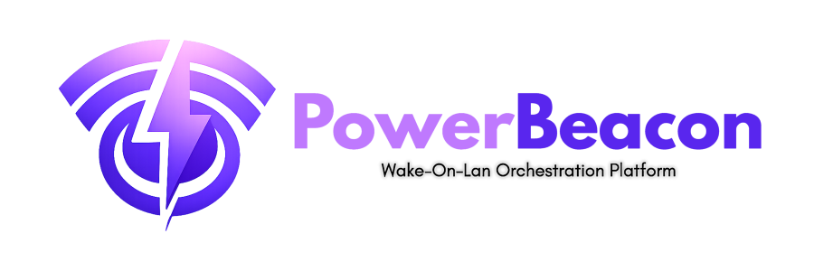

# Home

	

<strong>Wake-on-LAN orchestration for modern fleets</strong>

PowerBeacon helps you wake, manage, and monitor machines across distributed networks with a secure backend, a responsive frontend, and a lightweight cross-platform agent.

## Start Here

| Area                      | What you will find                                                |
| ------------------------- | ----------------------------------------------------------------- |
| [Setup](setup/initial.md) | Local development setup, first run, and environment configuration |
| Architecture              | How backend, frontend, and agent work together                    |
| API                       | Backend endpoints, auth model, and integration patterns           |
| Operations                | Deployment, monitoring, and production hardening notes            |

## Platform At A Glance

### Core Components

1. **Backend**
   Python service responsible for authentication, device lifecycle, scheduling, and control-plane APIs.
2. **Frontend**
   Web dashboard for operators to discover devices, issue wake actions, and manage environments.
3. **Agent**
   Small Go binary for network-side Wake-on-LAN execution and backend communication.

### Why PowerBeacon

- Centralized Wake-on-LAN orchestration for many devices and sites
- Pluggable deployment model: local docker-compose and cloud-ready topologies
- Security-first approach with authenticated control paths
- Practical observability and operational guidance for production setups

## Quick Launch

Follow the path below if you are new to the project:

1. Read [Initial Setup](setup/initial.md)
2. Run the stack with Docker Compose
3. Open the frontend and complete first configuration
4. Register or connect agents
5. Trigger your first wake operation

## Documentation Map

- **Setup**: Install and run locally, configure dependencies, and validate services.
- **Architecture**: Understand responsibilities and data flow across components.
- **API**: Learn endpoint behavior, contracts, and auth expectations.
- **Guides**: Task-focused walkthroughs and troubleshooting playbooks.
- **Operations**: Production deployment, monitoring, and maintenance best practices.

## Project Links

- Repository: [kotsiossp97/powerbeacon](https://github.com/kotsiossp97/powerbeacon)
- Issue tracker: [Open an issue](https://github.com/kotsiossp97/powerbeacon/issues)

---

Built for operators who want remote power control that is simple to run and reliable at scale.
