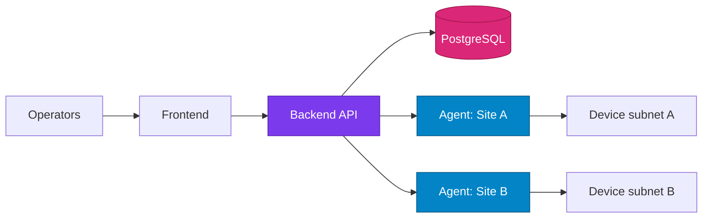

# Operations

Operations documentation covers deployment, observability, security posture, and maintenance workflows for production environments.

## Operational Pillars

| Pillar | Outcome | Example artifacts |
| --- | --- | --- |
| Deployment | Predictable releases | compose profiles, env templates |
| Observability | Fast incident detection | health checks, logs, metrics |
| Security | Reduced attack surface | secrets rotation, RBAC, CORS policies |
| Reliability | Stable runtime behavior | backups, restore drills, dependency updates |

## Production Topology (Reference)

## Runbook Baseline

=== "Daily"

    - Check service health endpoints
    - Review failed wake attempts
    - Confirm active agents and heartbeat freshness
    - Review cluster coverage for devices that require more than one relay path

=== "Weekly"

    - Rotate logs and verify retention
    - Review security events and admin changes
    - Validate backups and restore points

=== "Monthly"

    - Upgrade dependencies and base images
    - Rotate secrets where feasible
    - Rehearse incident response checklist

!!! warning "Docker Desktop limitation"
    Direct LAN wake broadcasts from containers on Windows/macOS are unreliable. Keep WOL execution on LAN-adjacent agents.
