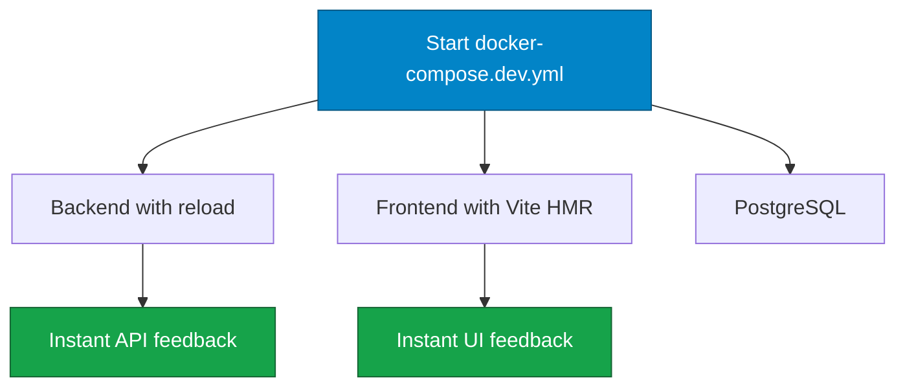

# Docker Setup

This is the recommended setup path for running PowerBeacon with minimal host dependencies.

!!! tip "Use this page if"
    You want the fastest path to a working environment with minimal host setup.

## Prerequisites

- Docker Engine / Docker Desktop
- Docker Compose v2 (`docker compose`)
- Open ports: `3000` (frontend), `8000` (backend), `5432` (db for dev compose)

## Environment Preparation

Create `.env` from the template at the repository root.

Linux/macOS:

```bash
cp .env.example .env
```

PowerShell:

```powershell
Copy-Item .env.example .env
```

At minimum, set these values:

```env
DB_PASSWORD=changeMe
JWT_SECRET=replace-with-strong-secret
```

!!! warning "Production safety"
    Replace default secrets before exposing the service beyond local development.

## Run Production-Like Stack

Uses `docker-compose.yml`.

```bash
docker compose up --build
```

Endpoints:

- Frontend: `http://localhost:3000`
- Backend API docs: `http://localhost:8000/api/docs`
- Health: `http://localhost:8000/health`

Stop:

```bash
docker compose down
```

=== "Run Foreground (debug)"

    ```bash
    docker compose up --build
    ```

=== "Run Detached"

    ```bash
    docker compose up -d --build
    docker compose logs -f
    ```

## Run Development Stack (Hot Reload)

Uses `docker-compose.dev.yml`.

```bash
docker compose -f docker-compose.dev.yml up --build
```

Endpoints:

- Frontend (Vite): `http://localhost:5173`
- Backend: `http://localhost:8000`
- PostgreSQL (host): `localhost:5432`

Logs:

```bash
docker compose -f docker-compose.dev.yml logs -f
```

Stop:

```bash
docker compose -f docker-compose.dev.yml down
```



## Verify Containers

```bash
docker compose ps
```

Expected services:

- `db`
- `backend`
- `frontend`

## WOL and the Agent Architecture

On Docker Desktop (Windows/macOS), direct UDP broadcast from containers is unreliable for LAN wake. PowerBeacon solves this with agents: install the lightweight `powerbeacon-agent` on a Linux machine in the target LAN, register it in the UI, and assign it to your devices. The backend dispatches WOL packets through the agent over HTTP instead of broadcasting directly.

On Linux hosts, an optional containerized agent deployment is supported when `network_mode: host` is used for the agent container.

!!! note "Recommended production pattern"
    Keep backend/frontend/db containerized, and deploy one or more agents close to the target subnets.

## Troubleshooting

### Build fails

1. Rebuild without cache:

```bash
docker compose build --no-cache
```

2. Check available disk space.

### Port conflict

If startup fails with bind errors, free or remap conflicting ports (`3000`, `5173`, `8000`, `5432`).

### Backend cannot connect to DB

1. Confirm `db` is healthy:

```bash
docker compose ps
```

2. Confirm `DB_PASSWORD` in `.env` matches compose environment assumptions.

### Clean reset

Use this when local state is corrupted:

```bash
docker compose down -v
docker compose up --build
```

## Next Step

If you plan to develop features, continue with [Local Development](development.md).
