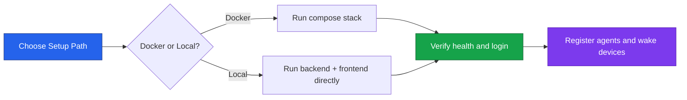

# Setup Overview

Use this section to get PowerBeacon running quickly, then choose the setup path that matches your workflow.



## Choose Your Setup Path

| Path | Best for | Time | Main command |
| --- | --- | --- | --- |
| [Docker Setup](docker.md) | Most users, fastest onboarding | 5-10 min | `docker compose up --build` |
| [Local Development](development.md) | Contributing and debugging internals | 15-30 min | `uv run fastapi dev main.py ` + `npm run dev` |

## Prerequisites

- Git
- Docker Desktop (recommended path)
- Or for local development: Python 3.13+, Node.js 20+, PostgreSQL 16+

!!! info "Suggested path"
    If you are evaluating the platform, start with Docker. If you are contributing code, use Local Development.

## Project Layout (High Level)

- `backend/`: FastAPI API service
- `frontend/`: React + Vite application
- `agent/`: Go Wake-on-LAN agent
- `docs/`: Documentation source (Zensical)

## Quick Start (Recommended)

### 1. Clone and enter project

```bash
git clone https://github.com/kotsiossp97/powerbeacon.git
cd powerbeacon
```

### 2. Create local environment file

Linux/macOS:

```bash
cp .env.example .env
```

PowerShell:

```powershell
Copy-Item .env.example .env
```

### 3. Start services

```bash
docker compose up --build
```

### 4. Open the app

- Frontend (production compose): `http://localhost:3000`
- Backend API docs: `http://localhost:8000/api/docs`

## Verify Setup

Use this checklist before moving on:

1. Frontend page loads in browser.
2. `GET /health` returns status `ok`.
3. You can log in and see the dashboard.
4. Device list page opens without API errors.

!!! success "Ready to continue"
    If all checks pass, continue with either [Docker Setup](docker.md) or [Local Development](development.md) for deeper workflows.

## First Steps After Setup

1. Continue with [Docker Setup](docker.md) for service operations and troubleshooting.
2. Continue with [Local Development](development.md) for day-to-day coding workflow.
3. Review architecture pages to understand component boundaries.

## Common Pitfalls

- Port `3000`, `5173`, `5432`, or `8000` already in use.
- Missing `.env` file.
- Docker Desktop on Windows/macOS cannot reliably send direct LAN broadcast WOL from containers. Prefer relay mode for production LAN wake flows.

